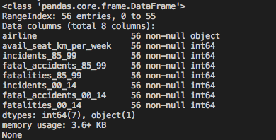
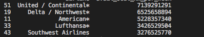
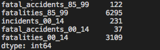
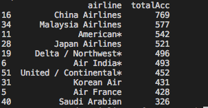
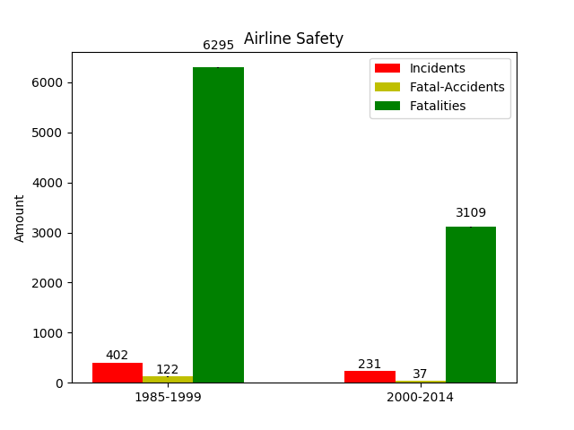

# Analyze Airline Safety with Pandas
This repository contains a dataset from the source: https://github.com/fivethirtyeight/data/tree/master/airline-safety

## Environment
- Python version 3.7
- Pandas version 0.23.4
- matplotlib version 2.2.3

## Pandas Tutorial
> Import pandas as pd.

`import pandas as pd`

> Read airline-safety.csv as a dataframe called data.

`data = pd.read_csv("airline-safety.csv")`

> How many rows and columns are there?

`data.info()`

> Which airline has the most avaialbe seats per week, and how many?

`data[data["avail_seat_km_per_week"] == data["avail_seat_km_per_week"].max()][["airline", "avail_seat_km_per_week"]]`

> Top 5 airlines which have the most available seats per week?

`data[["airline", "avail_seat_km_per_week"]].sort_values(by="avail_seat_km_per_week", ascending=False).head(5)`

> How many accidents are there?

`data.iloc[:, 3:].sum()`

> Top 10 airlines have the most accidents?
- without the airline column

`data.iloc[:, 3:].sum(axis=1).sort_values(ascending=False).head(10)`

- with the airline column

`data['totalAcc'] = data.iloc[:, 3:].sum(axis=1)`

`print(data[["airline", "totalAcc"]].sort_values(by="totalAcc", ascending=False).head(10))`

> Visualize the number of incidents, accidents and fatalities by matplotlib

